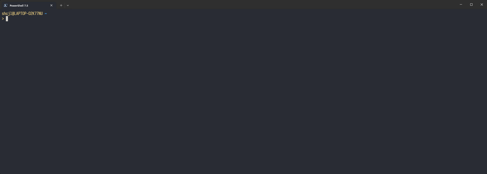

<!-- prettier-ignore-start -->
<!-- markdownlint-disable-next-line MD041 -->

<!-- prettier-ignore-end -->

<!-- markdownlint-disable-next-line MD033 -->
<div align="center">

<!-- First row -->

    

<!-- Second row -->

  

</div>

# PowerShell Scripting Projects

This repository is a collection of PowerShell scripts I've created to explore Windows-based automation and solve everyday problems in a practical way. My main goal with this project is to learn PowerShell by applying it to real-world tasks. Along the way, I hope to make these tools accessible and useful for others who are new to scripting or interested in automating their own workflows.

---

- [PowerShell Scripting Projects](#powershell-scripting-projects)
  - [Repository Structure Overview](#repository-structure-overview)
  - [Understanding the Command Line](#understanding-the-command-line)
  - [Tools Overview](#tools-overview)
    - [Coding Environment](#coding-environment)
      - [PowerShell 7.5](#powershell-75)
      - [Windows Terminal](#windows-terminal)
    - [oh-my-posh](#oh-my-posh)
      - [Visual Studio Code](#visual-studio-code)
  - [Projects \& Modules](#projects--modules)
    - [Set-TouchFile - Unix Touch Implementation in PowerShell with UX enhancements](#set-touchfile---unix-touch-implementation-in-powershell-with-ux-enhancements)
    - [Start-FastCopy – Controlled Folder-by-Folder Copying via FastCopy](#start-fastcopy--controlled-folder-by-folder-copying-via-fastcopy)
    - [Simple-Functions - Collection of Small Scripts for Terminal Fun \& Utility](#simple-functions---collection-of-small-scripts-for-terminal-fun--utility)
  - [Todos and Plans](#todos-and-plans)
    - [Repo Documentation Enhancements](#repo-documentation-enhancements)
    - [Project Set-TouchFile](#project-set-touchfile)
    - [Project Start-FastCopy](#project-start-fastcopy)
    - [Collection of Simple Functions](#collection-of-simple-functions)
    - [Future Project Plans](#future-project-plans)
  - [Feedback](#feedback)
  - [Author](#author)
  - [License](#license)

## Repository Structure Overview

```text
PowerShellScripts/
├── Collection_Simple-Functions/         # Small PowerShell utilities and fun scripts
├── Docs/                                # Setup tutorials and script documentation
├── Images/                              # Image assets
├── Project_Set-TouchFile/               # Implement unix touch in powershell with enhancements
├── Project_Start-FastCopy/              # FastCopy automation wrapper for throttled copy tasks
├── .gitignore                           # Git ignore file
├── LICENSE                              # MIT License
└── README.md                            # This file
```

## Understanding the Command Line

If you're new to scripting or command-line tools, don't worry - you're not alone. Many people feel intimidated at first, staring into the deep abyss of black windows with blinking cursors. But once you understand the three core building blocks - **the Operating System, the Shell, and the Terminal** - you’ll see that it’s not as mysterious or deep as it seems. With just a bit of guidance, you'll be ready to explore scripting step by step.

👉 [Understanding the Command Line - Core Elements](./Docs/Intro/CoreElements_Intro.md)

## Tools Overview

This section introduces the key tools used across the scripts and automation workflows in this repository. For detailed setup instructions, use the quick links below, or visit the [Documentation Folder](./Docs/).

If you are new to scripting, I recommend starting with the [PowerShell Setup Guide](./Docs/Setup/PowerShell_Setup.md) and following the tutorials sequentially until the environment is fully configured.

If you are already familiar with some tools or only need specific setups, feel free to jump directly to the ones you are interested in.

### Coding Environment

#### PowerShell 7.5

[PowerShell](https://learn.microsoft.com/en-us/powershell/scripting/overview?view=powershell-7.5) is a powerful, cross-platform shell and scripting language developed by Microsoft. It's designed for task automation, system configuration, and integrates deeply with Windows and the .NET runtime. This project uses PowerShell 7.5 on Windows.

In general, compared to the traditional Command Prompt (cmd.exe), PowerShell offers:

- Object-based input/output instead of plain text
- More consistent syntax and naming conventions
- Support for logic, loops, functions, and structured error handling
- Built-in tools like `Get-Help` for discovering how commands work

PowerShell 7+ is open source and actively maintained on [GitHub](https://github.com/PowerShell/PowerShell/tree/master). Its growing ecosystem of modules and tools makes it ideal for both beginners and advanced users.

👉 [PowerShell Setup Guide](./Docs/Setup/PowerShell_Setup.md)

#### Windows Terminal

[Windows Terminal](https://learn.microsoft.com/en-us/windows/terminal/) is a modern terminal app by Microsoft that supports multiple shells like PowerShell, Command Prompt, and WSL in a tabbed, customizable interface. It improves usability and adds modern features like transparency, Unicode, font ligatures, and theme control.

_Work in Progress_
👉 [Windows Terminal Setup Guide](./Docs/Setup/WindowsTerminal_Setup.md)

### oh-my-posh

[oh-my-posh](https://ohmyposh.dev) is a sleek, highly configurable prompt renderer for PowerShell and other shells. It enhances the look and clarity of your terminal with icons, colors, and segments. It integrates with Nerd Fonts for full visual support.

👉 [oh-my-posh Setup Guide](./Docs/Setup/oh-my-posh_Setup.md)

#### Visual Studio Code

[Visual Studio Code](https://code.visualstudio.com) (VSCode) is a lightweight yet powerful code editor with built-in support for PowerShell, Git, extensions, and debugging. It’s the primary editor used in this project for writing and managing scripts. The tutorials in this repo are based on the VSCode environment.

_Work in Progress_
👉 [VSCode Setup and Extensions](./Docs/Setup/VScode_Setup.md)

## Projects & Modules

### Set-TouchFile - Unix Touch Implementation in PowerShell with UX enhancements

Project Set-TouchFile is my implementation of the Unix touch command in PowerShell with additional enhancements. Key features include:

- Creates a new file if it does not already exist.

- Updates the last modified timestamp of an existing file without altering its contents.

- Provides user-friendly prompts to confirm actions, such as opening files and specifying new filenames.

- Includes validation helpers to ensure the filename and desired folder are valid under Windows rules before proceeding.

- Allows users to specify either relative or absolute paths for file operations, enhancing flexibility.

_Work in Progress_
👉 Check out the [Set-TouchFile README](./Project_Set-TouchFile/README.md)

### Start-FastCopy – Controlled Folder-by-Folder Copying via FastCopy

Project Start-FastCopy is a PowerShell wrapper designed to automate and control data transfer folder-by-folder using the FastCopy free software. It provides an interface with control over speed, verification, simulation, and delay between folder transfers. This script is ideal for conducting copying multiple folders of size 50-100GB to a backup folder. Key features include:

- Automated Per-subfolder copying from source to target directory

- Set speed control with FastCopy presets at the terminal: full, autoslow, suspend, or custom (1–9)

- Post-copy file verification toggle

- Dry run simulation using FastCopy’s /no_exec

- Optional thermal throttling with adjustable delay between folders

- Path to FastCopy.exe executable configuration via config.json

- Interactive confirmation with PowerShell ShouldProcess feature

_Work in Progress_
👉 Check out the [Start-FastCopy README](./Project_Start-FastCopy/README.md)

### Simple-Functions - Collection of Small Scripts for Terminal Fun & Utility

The SimpleFunctions folder contains a growing collection of lightweight, self-contained PowerShell functions designed for fun, learning, and daily scripting enhancements. These scripts are ideal for exploring how to use loops, output formatting, animation tricks, and terminal interactivity in PowerShell.

Examples Include:

- `./RenderPowerShellBanner`:
  Renders a ASCII art of PowerShell in different fonts and a scanner-style animation.
- `./ShowShapes`:
  Prints different shapes on to the terminal screen, including rectangle, triangle, cake, and spiner, etc.

More fun and visual terminal scripts on the way!

While not tied to automation tasks, these functions are great for building intuition about PowerShell scripting and experimenting with creative terminal outputs.

_Work in Progress_
👉 Browse the [Collection_Simple-Functions README](./Collection_Simple-Functions/README.md)

## Todos and Plans

This section presents current work-in-progress and some ideas for future developments in this repo. This todo list is updated frequently as development progresses.

<!-- prettier-ignore-start -->
<!-- markdownlint-disable-next-line -->
_Todo Last Updated: 2025-06-01_
<!-- prettier-ignore-end -->

### Repo Documentation Enhancements

- [x] Improve Repo README structure
  - [x] Find location to add table of contents
  - [x] Use link to documentation instead of listing the tutorials in the README

- [ ] Tool setup guides
  - [x] PowerShell Setup
  - [ ] Terminal Setup
  - [x] oh-my-posh Setup
  - [ ] VScode setup

- [ ] PowerShell Tutorial
  - [x] Introduce on shell, terminal, and OS

- [ ] Make this repo README look more attractive

### Project Set-TouchFile

- [ ] New features in Set-TouchFile
  - [ ] Silent mode toggle
  - [ ] Overwrite file toggle
  - [ ] Add logging

- [ ] Better documentation for Set-TouchFile
  - [ ] Build-in help block
  - [ ] Set-TouchFile README

### Project Start-FastCopy

- [ ] New features in Start-FastCopy
  - [x] Edit path for FastCopy executable in a config.json file, instead of using hard coded path
  - [ ] Add logging

- [ ] Better documentation for Start-FastCopy
  - [ ] Start-FastCopy build-in help block
  - [ ] Start-FastCopy README
    - [ ] Usage tutorial and demo with screenshots

- [ ] Make Start-FastCopy more modular

- [ ] Package Start-FastCopy as a PSmodule

### Collection of Simple Functions

- [ ] Better documentation in `./Collection_SimpleFunctions`
  - [ ] Add README for folder
  - [ ] Write documentation for current functions

- [ ] More simple function ideas

### Future Project Plans

- [ ] Automate backup of key folders using Task Scheduler + FreeFileSYnc

- [ ] Automate journal logging
  - [ ] Create a journal file daily
  - [ ] Automate git pull several times per day
  - [ ] Automate git push changes at the end of day

- [ ] Build a tool to monitor disk health status with `smartctl`.
  - [ ] Log disk status with smartctl output
  - [ ] Save key data history and create visualization
  - [ ] Alert user of critical events and potential drive failure

- [ ] Disk Space Analyzer on command line

## Feedback

Questions, issues, or suggestions are welcome!
If you find these scripts useful or have ideas for improvements, feel free to [open an issue](https://github.com/Alexander-556/PowerShellScripts/issues) or submit a pull request.

## Author

**Jialiang Chang** - undergraduate student, currently self-learning PowerShell scripting.  
This repository serves as both a learning log and a collection of practical scripts for everyday automation tasks.
Feel free to explore, adapt, and reuse anything that helps your workflow.

## License

This project is licensed under the [MIT License](LICENSE).  
You're free to use, modify, and share this code — just include attribution when you do.
