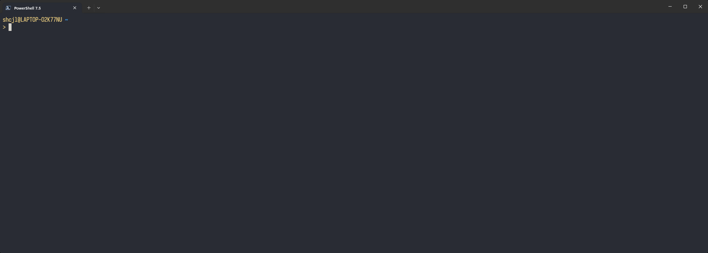

<!-- markdownlint-disable-next-line MD041 -->


<!-- markdownlint-disable-next-line MD033 -->
<div align="center">

<!-- First row -->

    

<!-- Second row -->

  

</div>

# PowerShell Scripting Projects

This repository is a collection of powershell scripts and functions created to solve problems that are relevant to me. My main purpose for this repo is to learn powershell as a windows based automation tool to try to automate my daily routines.

## Repository Structure

```pgsql
PowerShellScripts/
├── Collection_Simple-Functions/         # Small PowerShell utilities
├── docs/                                # Setup tutorials and script documentations
├── Images/                              # Image assets
├── Project_Start-FastCopy/              # FastCopy automation wrapper for copying folder by folder
├── .gitignore                           # Git ignore file
├── LICENSE                              # MIT License
└── README.md                            # This file
```

## Todos and Plans

This section presents current work-in-progress and some ideas for future developments in this repo. This todo list is updated frequently as development progresses.

<!-- markdownlint-disable-next-line MD036 -->
_Todo Last Updated: 2025-05-27_

### Repo Documentation Enhancements

- [ ] Complete this README structure for clarity
  - [ ] Find location to add table of contents
  - [ ] Use link to documentations instead of listing the tutorials in the README
- [ ] Complete documentation for necessary tool setup
  - [ ] PowerShell Setup
  - [ ] Terminal Setup
  - [ ] oh-my-posh Setup
  - [ ] VScode setup
    - [ ] Extensions
    - [ ] Debug
- [ ] Additional introduction to powershell information for information purposes
- [ ] Make this repo README look more attractive

### FastCopyTools

- [ ] New features in FastCopyTools script
  - [x] Edit path for FastCopy executable in a config.json file, instead of using hard coded path
  - [ ] Write log files for operation, determine the location the information in the log
- [ ] Better documentation for FastCopyTools
  - [ ] Usage tutorial and demo with screenshots in README

### Simple Functions

- [ ] Better documentation in `./SimpleFunctions`
  - [ ] Add README for folder
  - [ ] Write documentation for current functions
- [ ] More simple function ideas

### Future Project Plans

- [ ] Automate backup of key folders using Task Scheduler + FreeFileSYnc
- [ ] Automate journal logging
  - [ ] Create a journal file daily
  - [ ] Automate git pull several times per day
  - [ ] Automate git push changes at the end of day
- [ ] Build a tool to monitor disk health status with `smartctl`.
  - [ ] Log disk status with smartctl output
  - [ ] Save key data history and create visualization
  - [ ] Alert user of critical events and potential drive failure

## Tools Involved in Project

This section introduces the key tools used across scripts and setups in this repository. For setup instructions, visit the `./docs` folder.

### Coding Environment

#### PowerShell 7.5

[PowerShell](https://learn.microsoft.com/en-us/powershell/) is a powerful cross-platform shell and scripting language developed by Microsoft, ideal for task automation and system configuration. It offers deep integration with the Windows operating system and the .NET runtime. This repository uses the latest PowerShell 7.5 on Windows.  

Compare to traditional  Command Prompt (cmd.exe), PowerShell includes advanced features and better syntax, with:

- Object-based output instead of plain text
- More consistent syntax and command naming
- Access to complex logic, loops, error handling, and functions
- Built-in support with `Get-Help` for working with files, processes, registry, networking, and more

PowerShell 7+ is open-source and actively maintained on the [PowerShell GitHub Repo](https://github.com/PowerShell/PowerShell/tree/master), with a strong and growing community that contributes modules, tools, and documentations. This ecosystem makes it a robust choice for both beginners and professionals.

→ [Install & Configure PowerShell](./docs/PowerShell_Setup.md)

#### Windows Terminal

[Windows Terminal](https://learn.microsoft.com/en-us/windows/terminal/) is Microsoft’s modern terminal application that supports multiple profiles (e.g., PowerShell, Command Prompt, WSL) in a tabbed, customizable interface. It greatly improves usability over the default console, supports font ligatures, transparency, Unicode, and theme customization.

→ [Terminal Setup Guide](./docs/PowerShell_Setup.md)

#### oh-my-posh

[oh-my-posh](https://ohmyposh.dev) is a sleek and highly configurable prompt theming engine that enhances the visual appearance of your shell environment. It supports a wide range of themes and integrates with Nerd Fonts to display icons and glyphs. This tool adds both style and clarity to your command line workflows.

→ [Prompt Setup Guide](./docs/oh-my-posh_Setup.md)

#### Visual Studio Code

[Visual Studio Code](https://code.visualstudio.com) (VScode) is a popular code editor choice. It's lightweight and powerful with built-in support for PowerShell, Git, extensions, debugging and more. VScode is the primary editor used in this project for writing, testing, and managing PowerShell scripts efficiently, and the tutorials will be mainly based on VScode.

→ [Recommended VSCode Setup and Extensions](./docs/VScode_Setup.md)

## Projects & Modules

### FastCopyTools – Controlled Folder-by-Folder Copying via FastCopy

FastCopyTools is a modular PowerShell wrapper designed to automate and control folder-level data transfers using the FastCopy utility. It provides a scriptable interface with fine-tuned control over speed, verification, simulation, and delay between folder transfers.

🔧 Key Features
Per-subfolder copying from source to target directory

Speed control with presets: full, autoslow, suspend, or custom (1–9)

Post-copy file verification toggle

Dry run simulation using FastCopy’s /no_exec

Thermal-friendly throttling with adjustable delay between folders

Path configuration via config.json for FastCopy binary location

Interactive confirmation with ShouldProcess

This tool is ideal for users who want more transparency, control, or automation than the FastCopy GUI provides.

### SimpleFunctions

## Feedback

Questions, issues, or suggestions are welcome!
If you find these scripts useful or have ideas for improvements, feel free to [open an issue](https://github.com/Alexander-556/PowerShellScripts/issues) or submit a pull request.

## Author

**Jialiang Chang** — undergraduate student, currently self-learning PowerShell scripting.  
This repository serves as both a learning log and a collection of practical scripts for everyday automation tasks.
Feel free to explore, adapt, and reuse anything that helps your workflow.

## 📄 License

This project is licensed under the [MIT License](LICENSE).  
You're free to use, modify, and share this code — just include attribution when you do.
